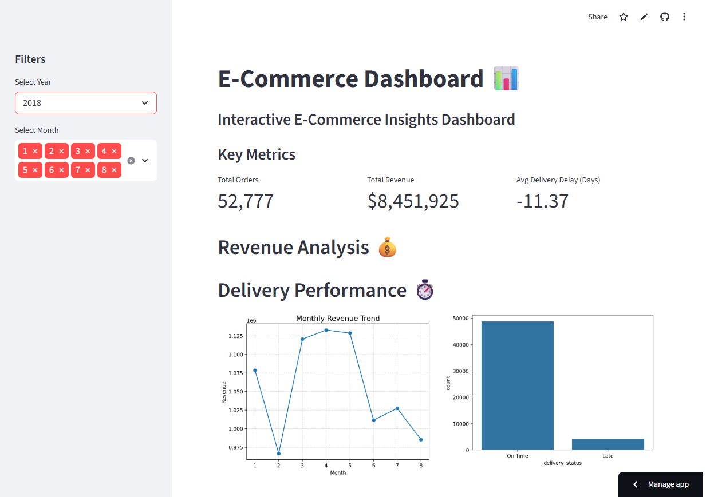
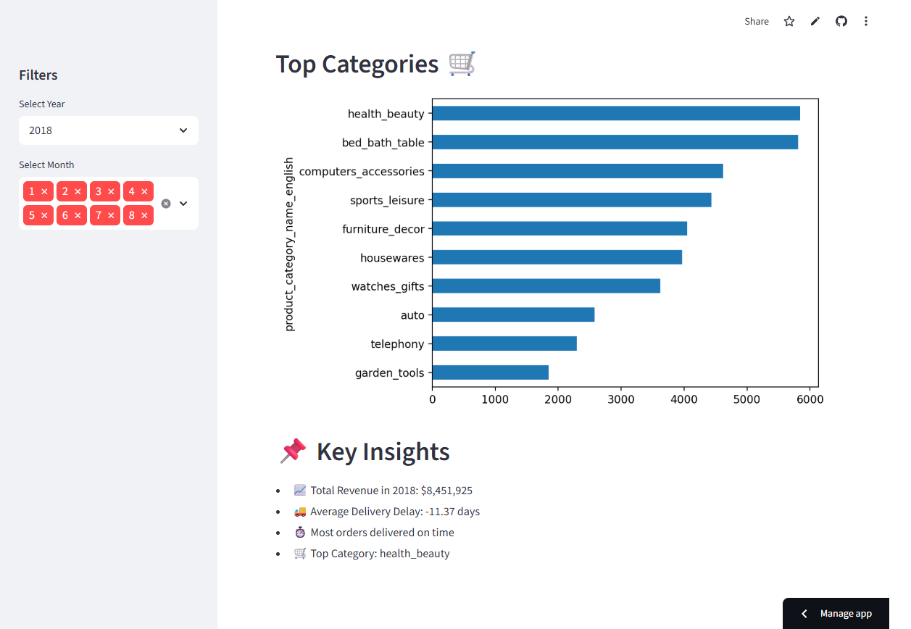

# E-Commerce Analytics Dashboard

## Overview
This project is an interactive dashboard built using Streamlit to analyze an e-commerce dataset of 100K+ orders.

## Features
- Revenue Analysis by Month
- Delivery Performance (On-time vs Late)
- Top Product Categories
- Interactive Filters (Year & Month)
- KPI Metrics (Orders, Revenue, Delivery Delay)

## Tech Stack
- Python
- Pandas
- Matplotlib / Seaborn
- Streamlit

## Live Demo
https://ecommerce-dashboard-3ghvdkzsasfhmseaocozph.streamlit.app/

## Dataset
Brazilian E-Commerce Public Dataset (Olist)

## 📸 Dashboard Preview

### 🔹 Overview

### 🔹 Detailed Insights

## Key Insights
- Majority of deliveries are completed on time
- Delivery delays vary across months
- Certain product categories dominate sales